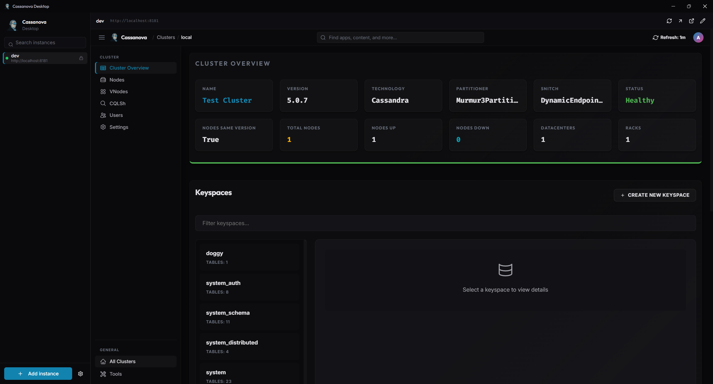

<h1 align="center">Cassanova Desktop</h1>

<p align="center">
  Desktop client for <a href="https://github.com/PoorTuna/Cassanova">Cassanova</a>.
  Manage every Cassandra cluster you own from a single window.
</p>

<p align="center">
  <a href="https://github.com/PoorTuna/Cassanova-Desktop/releases/latest"></a>
  <a href="./LICENSE"></a>
  
</p>

<p align="center">
  
</p>

## Why

Running more than one Cassanova instance means juggling browser tabs, login
forms, and self-signed cert warnings. Cassanova Desktop puts every instance
behind a sidebar, signs you in automatically, and keeps each cluster in its
own isolated session.

## Features

- **Multi-instance sidebar.** Add as many Cassanova endpoints as you run —
  dev, staging, prod — and switch between them from a single window.
- **Auto sign-in.** Credentials live in the OS keychain (`keytar`). The main
  process exchanges them for the Cassanova session cookie before the webview
  ever loads, so you land inside the app already authenticated.
- **Per-instance isolation.** Each instance renders in its own `<webview>`
  with a dedicated session partition — cookies, storage, and trust state
  never bleed between clusters.
- **TOFU certificate pinning.** Self-signed endpoints work out of the box.
  The first connect pins the fingerprint; a mismatch on the next connect is
  a hard failure, not a silent re-trust.
- **Command palette.** `Ctrl/Cmd+K` to jump between instances and views.
- **Auto-update** via `electron-updater` against GitHub Releases.

## Install

Grab a build from the [latest release](https://github.com/PoorTuna/Cassanova-Desktop/releases/latest):

| Platform | Artifact |
| --- | --- |
| Windows | `Cassanova Desktop Setup x.y.z.exe` (NSIS) or the portable `.exe` |
| macOS   | `.dmg` (Intel + Apple Silicon) |
| Linux   | `.AppImage`, `.deb`, `.rpm`, `.pacman`, `.tar.xz` |

Binaries are not code-signed yet — Windows SmartScreen and macOS Gatekeeper
will warn on first launch.

## Develop

Requires the Node.js version pinned in [`.nvmrc`](./.nvmrc).

```sh
npm install
npm run dev
```

## Build

```sh
npm run build          # compile main, preload, renderer
npm run package        # build + host-platform installer
npm run package:win    # nsis + portable
npm run package:mac    # dmg + zip, x64 + arm64
npm run package:linux  # AppImage + deb + rpm + pacman + tar.xz
```

## Scripts

| Command | |
| --- | --- |
| `npm run dev` | Electron dev server with HMR |
| `npm run build` | Production bundle for all three processes |
| `npm run typecheck` | `tsc --noEmit` on node and web tsconfigs |
| `npm run lint` | ESLint |
| `npm run format` | Prettier write |

## Architecture

Standard Electron split — main, preload, renderer — with a few deliberate
choices:

- **Renderer.** React + TanStack Router, Tailwind, Radix primitives. Each
  configured instance mounts a `<webview>` bound to its own
  `persist:instance-<id>` session, so two clusters never share storage.
- **Main.** Owns instance config (`userData/instances.json`), credentials
  (`keytar`), the auth handshake (`POST /login` → set `access_token` cookie
  on the matching session), and certificate trust (TOFU fingerprint pinning
  per instance).
- **Preload.** A narrow `contextBridge` surface; renderer never touches
  Node, the filesystem, or the keychain directly.

## License

MIT
